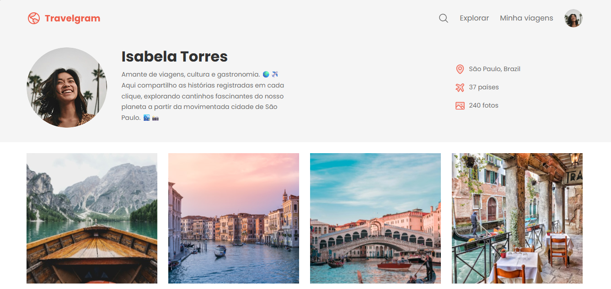

# Travelgram 🌍✈️

Amante de viagens, cultura e gastronomia.  
Histórias registradas em cada momento, explorando cantinhos fascinantes do nosso planeta.

## 🤳 Imagem do projeto



## ✨ Sobre o projeto
O **Travelgram** é um espaço para reunir experiências de viagem e transformá-las em narrativas visuais e culturais.  
A ideia é documentar momentos, lugares e sabores que inspiram, criando uma ponte entre código, fotografia e lifestyle.

---

## 📸 Funcionalidades
- Lista de imagens das viagens.

---

## 🚀 Tecnologias utilizadas
- **Projeto:** HTML e CSS    
- **Outros:** Git & GitHub para versionamento e colaboração

---

## 🗺️ Como executar o projeto
1. Clone este repositório:
   ```bash
   git clone https://github.com/seu-usuario/travelgram.git
   ```

2. Acesse este repositório:
   ```bash
   cd travelgram
   ```

3. No seu editor de código basta abrir o arquivo index.html ou Go Live:
   ```bash
   Se tiver o plugin Live Server basta clicar no botão Go Live
   ```

## 💻 Fique a vontade para colaborar
Projeto vai continuar em desenvolvimento com novas funcionalidades futuras.